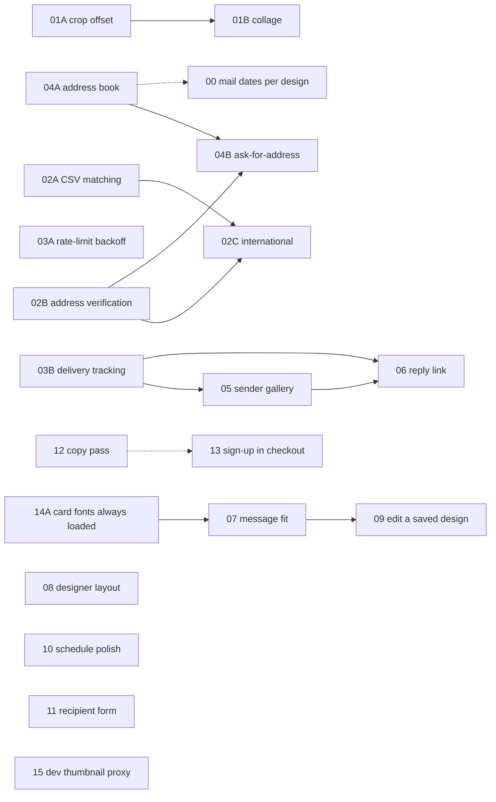

# Task briefs

One file per area of work, written to be handed to an agent cold. Each brief
names the files to open, the exact API surface to add, the tests that must
pass, and what is explicitly out of scope. Where a brief has lettered parts
(A, B, C), each part is a separate pull request that stands on its own; the
parts are in one file because they touch the same code and were designed
together.

**Read this file before starting any brief.** It holds the invariants that
apply to all of them, so the briefs themselves don't repeat them.

Written 2026-09-09, the day after the fork. `docs/NEXT-STEPS.md` covers the
work that has to happen *before* any of this — proving Lob and Stripe, the
design pass, mobile — and nothing here should land ahead of §1 and §2 of that
file being ticked off against real keys.

---

## Status lives in the brief

Each brief opens with frontmatter, the same dialect Beluga's roadmap script
reads. Beluga's `scripts/roadmap.ts` is not ported to this repo yet; until it
is, the table at the bottom of this file is kept by hand.

```yaml
---
task: "03"
title: Fulfilment
status: todo          # todo | in-progress | done
tier: 0
size: M               # S | M | L, for the whole file
migration: one table
blocked_by: []        # task numbers this waits on
blocks: []            # task numbers waiting on this
touches: server/fulfilment.ts:104 · server/lob.ts
completed:            # YYYY-MM-DD, required once status is done
shipped_in:           # PR number
summary: >-
  Two to four sentences.
---
```

**When you pick a part up**, set `status: in-progress` and say which part in
the PR title (`03A rate-limit backoff`). **When the last part lands**, set
`status: done`, fill `completed` and `shipped_in`. A file with some parts
shipped stays `in-progress` and lists what shipped in a `## Progress` section
at the top of the body.

---

## The invariants

These are `CLAUDE.md`'s rules, restated because every brief below leans on at
least one of them. A change that breaks one is wrong even if it passes.

1. **Money is integer cents, everywhere.** See `shared/money.ts`.
2. **Money never comes from the request.** Checkout reads the price from
   `store_settings` and multiplies by designs × recipients
   (`server/routes/checkout.ts:83`). A request carries design ids, dates and
   recipients only. Brief 02C adds a second price; it is still read from
   settings, never from the cart.
3. **The webhook is the only thing that marks an order paid**, and the only
   thing that moves postcards from `pending` to `scheduled`.
4. **Webhook handling is idempotent.** Events are deduplicated by id
   (`recordWebhookEvent` / `forgetWebhookEvent`). Brief 03B adds a second
   webhook source and reuses the same table.
5. **Every admin route is behind `requireAdmin` + `verifyCsrf`**, applied
   once to the router in `server/routes/admin.ts`. Customer routes sit behind
   `requireCustomer` the same way (`meRouter` in `server/routes/account.ts`).
   New routes of either kind go in `server/security.test.ts`. Not optional.
6. **Every schema change lands in both dialects.** Edit `db/schema.sqlite.ts`
   and `db/schema.pg.ts` together, `npm run db:generate`, commit both
   migration folders. `db/dialect.test.ts` runs against both engines.
7. **Only the fulfilment sweep talks to Lob's postcards endpoint**, and only
   `claimPostcard`'s conditional update decides who sends a card. Our
   postcard id is Lob's idempotency key. Brief 02B adds Lob's *verification*
   endpoints, which are reads, called from a request handler with their own
   rate limit; that is the one exception and it is spelled out there.
8. **Lob's refusal is stored in Lob's words** on the postcard row.

## Conventions to match

- **Validation lives in `shared/`** as zod schemas imported by both sides of
  the wire. `shared/postcards.ts` is the domain; `shared/account.ts`,
  `shared/cart.ts`, `shared/orders.ts` and `shared/api.ts` hold the inputs.
- **Routes stay thin.** Parse, call a repository function, respond. SQL lives
  in `db/*-repository.ts`.
- **Errors** use `httpError(status, message)` from `server/middleware.ts`.
  Messages are user-facing: say what went wrong and what to do.
- **Client mutations** go through `csrfPost` / `csrfPut` / `csrfDelete` from
  `src/lib/api.ts`, wrapped in a hook (`src/lib/account.ts` is the model for
  customer-facing ones) that invalidates its query key.
- **Customer-facing views of an order go through `toCustomerOrder`**
  (`server/routes/account.ts:82`). Anything a buyer must not see — Lob's
  error text, and a reply's recipient address — is stripped there and
  nowhere else.
- **The back of the card is drawn twice on purpose.** `print/back.hbs` is
  what Lob renders; `src/components/postcard/PostcardBackMock.tsx` is what
  the buyer sees. They share inch measurements. Change both or neither.
- **Styling.** Storefront pages use CSS Modules next to the component and the
  `--beluga-*` tokens from `src/index.css`; antd supplies the controls. The
  account pages (`src/pages/account/Account.module.css`) are the reference
  for anything new under `/account`: `.card`, `.cardHeader`, `.meta`,
  `.table`, `.nav`. The designer's own classes are in
  `src/components/postcard/Postcard.module.css`. For a wider palette of
  patterns — settings forms, lists with row actions, empty states — the
  upstream Beluga storefront and admin in `../beluga/src` are the reference;
  this fork kept its conventions.
- **Comments explain why, not what**, in the register the codebase already
  uses.

## Commands

```bash
npm run typecheck && npm run lint && npm test
npm run test:e2e        # needs data/e2e.sqlite migrated + seeded once
npm run db:generate     # after editing BOTH schema files
npm run db:migrate
```

## Definition of done

- `npm run typecheck && npm run lint && npm test` pass.
- New server routes are in `server/security.test.ts`: admin routes in
  `MUTATIONS` / `READS`; customer routes in the customer-session cases;
  public routes with a case that shows the rate limit or signature check.
- New schema fields appear in both dialect files and both migration folders,
  and `db/dialect.test.ts` covers them.
- Both faces of the postcard still agree if either was touched.
- `README.md` is updated if behaviour a person would notice changed.
- The brief's frontmatter is updated as described above.

## Dependency graph



## Suggested order

1. **03A**, **00**, **01A**, **02A** — small, no migrations, each removes a
   real friction point. 03A first because it protects paid cards.
2. **02B** address verification, then **02C** international.
3. **03B** delivery tracking; it is a prerequisite for the gallery's status
   column and for the reply link's "only after delivery" gate.
4. **04A** address book, then **04B** ask-for-address links.
5. **05** sender gallery, including the retention change.
6. **06** reply link, phases A then B.
7. **01B** collage, whenever there is appetite; nothing depends on it.

Briefs 07–15 came out of a new-customer walkthrough on 2026-09-10 (the
storefront, the designer, the cart, sign-up and the account pages, on a
desktop and a phone). None needs a migration. Suggested order:

8. **14** first — 07's fit measurement depends on the card fonts actually
   loading — then **07**, which is the one that loses words off a paid card.
9. **11**, **12**, **15**, **10** — each an hour or three, independent.
10. **08**, **09**, **13** — the designer's layout, editing a saved design,
    and the sign-up flow; half a day each.

## Tasks

| # | Title | Status | Tier | Size | Migration |
|---|-------|--------|------|------|-----------|
| 00 | [Mail dates per design](00-mail-dates.md) | done | 0 | S | none |
| 01 | [Front of card: crop offset and collage](01-front-of-card.md) | in-progress (A done) | 1 | L | none |
| 02 | [Recipients: CSV matching, verification, international](02-recipients.md) | done | 1 | L | columns on three tables |
| 03 | [Fulfilment: rate-limit backoff and delivery tracking](03-fulfilment.md) | in-progress (A, B built) | 0 | M | one table |
| 04 | [Address book and ask-for-address links](04-address-book.md) | done | 2 | L | one table + columns |
| 05 | [Sender gallery and send again](05-sender-gallery.md) | done | 2 | M | none |
| 06 | [Reply link](06-reply-link.md) | done | 3 | L | columns on three tables |
| 07 | [Back of card: the message must fit](07-back-of-card-fit.md) | todo | 0 | M | none |
| 08 | [Designer: photo frame, layout, price line, batch explainer](08-designer-layout.md) | todo | 1 | M | none |
| 09 | [Edit a saved design](09-edit-saved-design.md) | todo | 1 | S | none |
| 10 | [Schedule: surface “ahead of a date”, tidy per-date cards](10-schedule-polish.md) | done | 2 | S | none |
| 11 | [Recipients: state picker, honest buttons, unbroken row](11-recipient-form.md) | todo | 1 | S | none |
| 12 | [Copy: one delivery estimate, tenses, labels](12-copy-pass.md) | done | 1 | S | none |
| 13 | [Sign up without leaving the checkout](13-signup-in-checkout.md) | todo | 1 | M | none |
| 14 | [Shell: card fonts always loaded, footer stays down](14-shell-fonts-and-footer.md) | todo | 0 | S | none |
| 15 | [Dev only: fresh thumbnails broken in the schedule](15-dev-thumbnail-proxy.md) | done | 3 | S | none |
