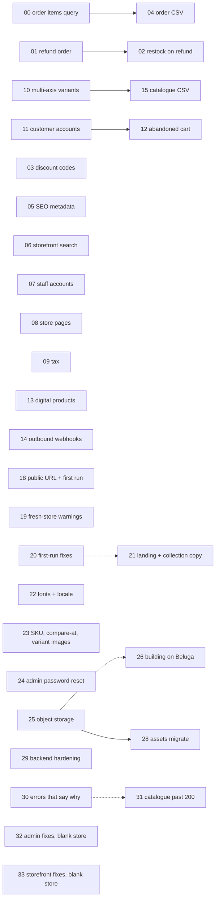

# Task briefs

One file per unit of work, written to be handed to an agent cold. Each brief
names the files to open, the exact API surface to add, the tests that must pass,
and what is explicitly out of scope.

**Read this file before starting any brief.** It holds the invariants that apply
to all of them, so the briefs themselves don't repeat them.

**A brief means the approach is decided.** Work that is understood but not yet
decided lives in `docs/gaps/` instead — it is deliberately outside the numbering,
the roadmap and the table below, because listing it as a task would claim a plan
that does not exist. Move a gap into `docs/tasks/` as a numbered brief once
someone has chosen how to close it.

---

## Status lives in the brief

Each brief opens with frontmatter. It is the **single source of truth** for
status — `docs/roadmap.html` is generated from it, so there is no second place
to update and nothing to keep in step.

```yaml
---
task: "03"
title: Discount codes via Stripe
status: todo          # todo | in-progress | done
tier: 0
size: S               # S | M | L
migration: one column
blocked_by: []        # task numbers this waits on
blocks: []            # task numbers waiting on this
touches: server/routes/checkout.ts:138 · emails/
completed:            # YYYY-MM-DD, required once status is done
shipped_in:           # PR number, e.g. 42
summary: >-
  Two to four sentences. Rendered on the roadmap page; supports `code`
  and **bold**.
---
```

**When you pick a task up**, set `status: in-progress`. **When it lands**, set
`status: done`, fill `completed` and `shipped_in`, then run:

```bash
npm run roadmap
```

That regenerates `docs/roadmap.html` and the task table at the bottom of this
file. Commit the regenerated page with your change — the changelog on that page
is built from `completed` dates, so it writes itself as work lands.

**`shipped_in` is a PR number, not a commit sha.** A sha cannot go in the commit
that produces it: the frontmatter and the regenerated page are both inside that
commit, and amending to add the sha changes the sha. A PR number exists before
the merge does, so it can be written as part of the branch's own work. Tasks 00
through 07 predate this and carry shas, recorded in a follow-up commit each.

**Tasks 08 through 12 have an empty `shipped_in`, and that is correct — leave
them alone.** They were committed straight to `main` before this project started
opening pull requests, so there is no number to record: `git ls-remote origin
'refs/pull/*/head'` shows the first PR on this repository is #1, which merged
task 13. This has already been round-tripped once — a commit set task 11's
`shipped_in` to the sha `fd1d6f6`, and the review that followed took it back out,
because the field is a PR number and putting a sha there makes the roadmap claim
a PR that does not exist. Empty is the honest value. Do not "fix" it.

The generator validates as it goes: an unknown status, an empty summary, or
`done` without a `completed` date fails the build rather than producing a
misleading page.

---

## The invariants

These are load-bearing. A change that breaks one is wrong even if it passes.

1. **Money is integer cents, everywhere.** No floats, no `* 100`. See
   `shared/money.ts`. v1 sent Stripe amounts like `1998.9999999999998`.
2. **Money never comes from the request.** Prices and totals are read from the
   database on every path. A request carries product/variant ids and quantities
   only. See the loop at `server/routes/checkout.ts:58`.
3. **The webhook is the only thing that marks an order paid.** The success
   redirect proves nothing. Don't add payment state transitions anywhere else.
4. **Webhook handling is idempotent.** Events are deduplicated by id, and a
   failed handler releases the dedup record so Stripe's retry is processed.
   See `recordWebhookEvent` / `forgetWebhookEvent` in `db/orders-repository.ts`.
5. **Every admin route is behind `requireAdmin` + `verifyCsrf`**, applied once to
   the whole router at `server/routes/admin.ts:55`. Never mount an admin
   endpoint outside that router.
6. **Every schema change lands in both dialects.** `db/schema.sqlite.ts` and
   `db/schema.pg.ts` are edited together, then `npm run db:generate` emits a
   migration for each into `db/migrations/{sqlite,pg}/`. Commit all of it.
7. **Products reach Stripe only via explicit publish** —
   `POST /api/admin/products/:id/publish`. Never write to Stripe on save.
8. **Stripe Prices are immutable.** Changing an amount creates a new Price and
   archives the old one, which is why historic orders still resolve. Don't
   "fix" this by mutating.

## Conventions to match

- **Validation lives in `shared/`** as zod schemas, imported by both sides of the
  wire. Add input schemas to `shared/api.ts` (or `shared/orders.ts` for order
  shapes), never inline in a route.
- **Routes stay thin.** Parse, call a repository function, respond. All SQL lives
  in `db/*-repository.ts`.
- **Errors** use `httpError(status, message)` from `server/middleware.ts`, and
  `toHttp(error)` in `server/routes/admin.ts:57` maps known error types.
  Messages are user-facing: say what went wrong and what to do.
- **Client mutations** go through `csrfPost` / `csrfPut` / `csrfDelete` from
  `src/lib/api.ts`, wrapped in a hook in `src/admin/queries.ts` that invalidates
  both its own key and the public store key.
- **Comments explain why, not what.** The existing codebase comments decisions
  and the v1 mistakes they correct. Match that register; don't narrate syntax.

## Commands

```bash
npm run typecheck      # tsc -b
npm run lint           # eslint
npm test               # vitest, unit + component + dialect
npm run test:e2e       # playwright
npm run db:generate    # after editing BOTH schema files
npm run db:migrate     # apply
```

`db/dialect.test.ts` runs the same assertions against SQLite and Postgres
(via `embedded-postgres`, no system install needed). If you touch the query
layer, it must stay green for both.

### A fresh checkout has no store in it

`npm test` seeds its own database per suite, so unit tests pass anywhere. **`npm
run test:e2e` does not** — Playwright drives the real app against
`data/beluga.sqlite`, and in a fresh clone or a new git worktree that file is
either absent or an empty stub. The whole suite then fails on the landing page
with `getByRole('heading', { name: '<store name>' })` not found, which reads
like a broken storefront and is in fact an empty database:

```bash
npm run db:migrate && npm run db:seed
```

Do that once per checkout, before blaming a change for the failures. It is also
a free check that your new migration actually applies.

Two more things that look like bugs and are not:

- **`.env` is irrelevant to e2e.** `playwright.config.ts` deliberately points
  `ENV_FILE` at a file that does not exist, so the suite sees the same
  configuration on every machine. Copying a `.env` in will not fix a failing
  run, and having Stripe keys locally will not change one.
- **Postgres skips silently.** `postgresHarness()` in `db/dialect.test.ts`
  returns `null` if `embedded-postgres` cannot start, and `describe.skipIf`
  then drops that whole half of the suite — a green run is *not* proof both
  dialects passed. Confirm with `--reporter=verbose` and look for
  `repository on postgres`.

## Definition of done

- `npm run typecheck && npm run lint && npm test` all pass.
- New server routes are added to the `MUTATIONS` or `READS` arrays in
  `server/security.test.ts`. **This is not optional** — that file is what stops
  an unprotected endpoint from shipping.
- New schema fields appear in both dialect files and both migration folders.
- The README section for the area you touched is updated if behaviour changed.
- No `console.log` left behind except deliberate operator-facing lines that
  match the existing style (see `server/email.ts:114`).
- The brief's frontmatter says `status: done` with a `completed` date and a
  `shipped_in` PR number, and `npm run roadmap` has been run and its output
  committed.

## Dependency graph



Everything not joined by an arrow is independent and can run in parallel.
**Conflict warning:** 01, 02 and 03 all touch `src/admin/OrderDetailPage.tsx`
or the order schema. Land 01 before starting 02. Among the briefs from the
first-run review (18–26): 20 and 21 both edit `src/pages/LandingPage.tsx`, and
21 supersedes 20's last group; 22 and 25 both extend the CSP in
`server/middleware.ts`, so land one before starting the other. Among the briefs
from the blank-store review (29–33): 30 and 31 both edit the publish route in
`server/routes/admin.ts`, and 29 and 30 both touch `server/middleware.ts`; land
one of each pair before starting the other. 32 and 33 are CSS and
client-side. The dotted arrows are "easier after", not "blocked
by".

## The briefs

Generated by `npm run roadmap` — edit a brief's frontmatter, not this table.

<!-- begin:tasks -->
| | # | Brief | Size | Migration |
| --- | --- | --- | --- | --- |
| ✅ | 00 | [Fetch order items by order id](00-order-items-query.md) | Small | none |
| ✅ | 01 | [Refund an order from the admin](01-refund-order.md) | Small | one column |
| ✅ | 02 | [Restore stock when an order is refunded](02-restock-on-refund.md) | Small | one column |
| ✅ | 03 | [Discount codes via Stripe](03-discount-codes.md) | Small | one column |
| ✅ | 04 | [Export orders as CSV](04-order-csv-export.md) | Small | none |
| ✅ | 05 | [Per-product SEO metadata](05-seo-metadata.md) | Medium | two columns |
| ✅ | 06 | [Storefront search and sort](06-storefront-search.md) | Small | none |
| ✅ | 07 | [Staff accounts](07-staff-accounts.md) | Medium | one column |
| ✅ | 08 | [Store pages](08-store-pages.md) | Medium | one table |
| ✅ | 09 | [Sales tax and VAT](09-tax.md) | Medium | product + rate columns |
| ✅ | 10 | [Multi-axis variants](10-multi-axis-variants.md) | Large | two tables + backfill |
| ✅ | 11 | [Customer accounts](11-customer-accounts.md) | Large | two tables + orders column |
| ✅ | 12 | [Abandoned cart recovery](12-abandoned-cart.md) | Large | one table |
| ✅ | 13 | [Digital and downloadable products](13-digital-products.md) | Medium | one column |
| ✅ | 14 | [Outbound webhooks](14-outbound-webhooks.md) | Medium | two tables |
| ✅ | 15 | [Catalogue CSV import and export](15-catalogue-csv.md) | Medium | none |
| ✅ | 17 | [Storefront copy and the gaps a UI pass found](17-copy-and-structural-gaps.md) | Medium | none |
| ✅ | 18 | [Setup asks for the public URL, and the URLs Beluga prints are true](18-public-url-and-first-run.md) | Small | none |
| ✅ | 19 | [What a fresh store does not tell its merchant](19-what-a-fresh-store-does-not-say.md) | Small | none |
| ✅ | 20 | [Small fixes a first run turned up](20-small-fixes-from-a-first-run.md) | Small | none |
| ✅ | 21 | [Landing page and collection copy the admin can edit](21-landing-and-collection-copy.md) | Medium | columns on store_settings and collections |
| ✅ | 22 | [Web fonts that load, and a locale for the numbers](22-typeface-and-locale.md) | Medium | two columns on store_settings |
| ✅ | 23 | [SKUs, compare-at prices and per-variant images](23-product-model-gaps.md) | Large | two columns on variants, one on product_images, one on order_items |
| ✅ | 24 | [An administrator can reset a forgotten password](24-admin-password-reset.md) | Small | two columns on admin_users |
| ✅ | 25 | [Object storage for uploaded images](25-object-storage-for-images.md) | Medium | none |
| ✅ | 26 | [Building on Beluga: which files are yours to change](26-building-on-beluga.md) | Small | none |
| · | 27 | [A store that is deployed but not yet open](27-storefront-preview-mode.md) | Medium | four columns on store_settings |
| · | 28 | [Move an existing image directory into the bucket](28-assets-migrate.md) | Small | none |
| ✅ | 29 | [Backend hardening from the blank-store review](29-backend-hardening.md) | Small | none |
| · | 30 | [Errors that say what went wrong](30-errors-that-say-why.md) | Small | none |
| · | 31 | [Checkout, quotes and publish past 200 live products](31-catalogue-past-200.md) | Small | none |
| · | 32 | [Admin fixes from a blank-store run](32-admin-fixes-from-a-blank-store.md) | Small | none |
| · | 33 | [Storefront fixes from a blank-store run](33-storefront-fixes-from-a-blank-store.md) | Medium | none |
<!-- end:tasks -->
